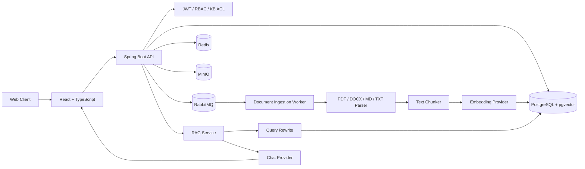

# KnowFlow

> 面向中小团队的多租户企业知识库与 RAG 智能问答平台。

KnowFlow 是一个前后端分离的企业知识管理项目，围绕 **文档接入、权限控制、向量检索、RAG 问答、引用溯源、索引生命周期和组织协作** 构建。项目重点不是单纯调用大模型，而是把企业知识库中常见的权限、异步处理、检索安全和索引维护问题串成完整工程链路。

## 核心能力

- **多租户与组织体系**：租户、部门、成员、OWNER / ADMIN / MEMBER 角色管理。
- **知识库 ACL**：支持 `TENANT`、`DEPARTMENT`、`MEMBER`、`PRIVATE` 四种可见范围。
- **文档接入**：支持 PDF、DOCX、Markdown、TXT，文件存储在 MinIO。
- **异步索引**：RabbitMQ 驱动文档解析、切片、Embedding 和 pgvector 入库。
- **RAG 问答**：向量检索 + 权限过滤 + 引用溯源，回答严格基于检索证据。
- **多轮对话**：对上下文追问进行 Query Rewrite，再执行检索。
- **索引生命周期**：索引签名、过期检测、批量重建、失败恢复和真实任务进度。
- **索引安全**：只检索当前文档版本且状态为 READY 的 Chunk。
- **审计与完整性检查**：写操作审计、僵尸任务恢复、孤儿 Chunk / 过期索引检查。
- **文本编码兼容**：Markdown / TXT 支持 UTF-8、UTF-16LE、UTF-16BE，并提供 GB18030 fallback。

## 技术栈

| 层级 | 技术 |
| --- | --- |
| Frontend | React 19、TypeScript、Vite、Ant Design、React Router、TanStack Query、Zustand、PDF.js |
| Backend | Java 21、Spring Boot 3.5、Spring MVC、Spring Security、JWT、MyBatis-Plus / MyBatis、Flyway |
| Database | PostgreSQL 17、pgvector |
| Middleware | Redis、RabbitMQ、MinIO |
| AI | OpenAI-compatible Provider；Chat Model + Embedding Model |
| Deployment | Docker、Docker Compose、Nginx-ready |

## 系统架构



## 文档索引流程

```text
上传文档
   ↓
MinIO 保存原文件
   ↓
创建 document / document_version / ingestion_task
   ↓
RabbitMQ
   ↓
Parser
   ↓
Chunker
   ↓
Embedding
   ↓
事务性替换当前版本 Chunk
   ↓
pgvector
   ↓
READY + index_signature + indexed_at
```

重新索引时会先完成全部新 Embedding，再在数据库事务中替换旧 Chunk。若新索引失败，不会提前破坏上一份成功索引。

## 权限模型

知识库支持四种可见范围：

| Visibility | 说明 |
| --- | --- |
| `TENANT` | 当前租户所有成员可访问 |
| `DEPARTMENT` | 仅指定部门可访问 |
| `MEMBER` | 仅指定成员可访问 |
| `PRIVATE` | 仅创建者可访问 |

权限校验不仅存在于前端菜单，还会进入后端知识库查询和向量检索 SQL，避免通过伪造 Knowledge Base ID 绕过权限。

## RAG 流程

```text
用户问题
   ↓
读取最近会话
   ↓
Query Rewrite
   ↓
Embedding
   ↓
租户 + ACL + READY + currentVersion 过滤
   ↓
pgvector Top-K
   ↓
构造证据上下文
   ↓
LLM 生成回答
   ↓
Citation 归一化
   ↓
返回回答 + 引用片段
```

当检索不到可靠证据时，系统不会让模型自由补全企业内部事实。

## 项目结构

```text
knowflow/
├─ backend/                   # Spring Boot API
│  ├─ src/main/java/com/knowflow/
│  │  ├─ ai/                  # Chat / Embedding Provider
│  │  ├─ auth/                # JWT 登录鉴权
│  │  ├─ document/            # 上传、解析、索引、任务恢复
│  │  ├─ knowledge/           # Knowledge Base 与 ACL
│  │  ├─ organization/        # 部门与成员
│  │  ├─ retrieval/           # pgvector 检索
│  │  ├─ audit/               # 审计日志
│  │  └─ admin/               # 系统完整性检查
│  └─ src/main/resources/
│     └─ db/migration/        # Flyway V1 ~ V7
├─ frontend/                  # React + TypeScript
├─ samples/                   # 演示文档
├─ docker-compose.yml
├─ .env.example
└─ README.md
```

## 本地启动

### 1. 环境要求

建议安装：

- Java 21（仅本地直接运行后端时需要）
- Node.js 20+
- Docker Desktop
- Git

如果全部通过 Docker Compose 启动，核心依赖由容器提供。

### 2. 配置环境变量

复制示例配置：

```bash
cp .env.example .env
```

Windows PowerShell：

```powershell
Copy-Item .env.example .env
```

根据自己的模型服务填写 `.env`。**不要把真实 API Key 提交到 Git。**

### 3. 启动

本项目当前 Windows 开发环境使用：

```powershell
docker-compose up -d --build
```

查看状态：

```powershell
docker-compose ps
```

后端健康检查：

```powershell
Invoke-RestMethod "http://localhost:8080/actuator/health"
```

前端默认访问：

```text
http://localhost:3000
```

后端默认访问：

```text
http://localhost:8080
```

## 常用管理接口

| Method | Endpoint | 用途 |
| --- | --- | --- |
| GET | `/actuator/health` | 后端健康检查 |
| GET | `/api/admin/system-check` | OWNER / ADMIN 系统完整性检查 |
| GET | `/api/audit-logs?limit=100` | OWNER / ADMIN 查看审计日志 |
| POST | `/api/documents/{id}/reindex` | 单文档重新索引 |
| GET | `/api/knowledge-bases/{id}/documents/index-status` | 索引状态统计 |
| POST | `/api/knowledge-bases/{id}/documents/repair-indexes` | 批量修复过期/失败索引 |

## 索引版本管理

当前索引签名由以下因素组成：

```text
parser-version | chunker-version | embedding-model | embedding-dimensions
```

例如：

```text
parser-v2|chunker-v1|text-embedding-v4|1024
```

Parser、Chunker、Embedding 模型或向量维度发生变化时，系统会将旧索引标记为 `NEEDS_REINDEX`，而不是每次部署都无条件重新向量化。

## 数据一致性检查

管理员可以调用：

```http
GET /api/admin/system-check
```

理想状态：

```json
{
  "orphanChunks": 0,
  "nonCurrentChunks": 0,
  "readyDocumentsWithoutChunks": 0,
  "activeIngestionTasks": 0,
  "failedDocuments": 0,
  "needsReindexDocuments": 0
}
```

## 安全说明

仓库不应包含：

- `.env`
- API Key
- JWT / Refresh Token
- 数据库生产密码
- MinIO 生产凭据
- IDE 本地配置
- `node_modules`
- Maven `target`
- 前端 `dist`
- 临时补丁和备份目录

首次公开仓库前建议再次执行：

```powershell
git status
git diff --cached
```

并确认 `.env` 没有被暂存。

## 已完成的工程化处理

- JWT 认证与 RBAC
- Knowledge Base 细粒度 ACL
- RAG 检索层权限过滤
- pgvector 向量检索
- 多轮 Query Rewrite
- Citation 引用归一化
- RabbitMQ 异步文档索引
- MinIO 文件存储
- 文档索引签名
- 批量索引修复
- 索引失败保护与僵尸任务恢复
- UTF-16 / UTF-8 文本编码兼容
- 写操作审计
- 管理员数据完整性检查
- Flyway 数据库迁移

## 后续规划

V1 之后可以继续扩展：

- 文档历史版本与回滚 UI
- OCR 扫描版 PDF
- 混合检索（BM25 + Vector）
- Reranker
- 知识库级检索参数配置
- CI/CD 与自动化测试
- Prometheus / Grafana 监控
- 对象存储生命周期策略

## License

本项目当前未指定开源许可证。公开代码前可根据实际用途选择合适的 License。
