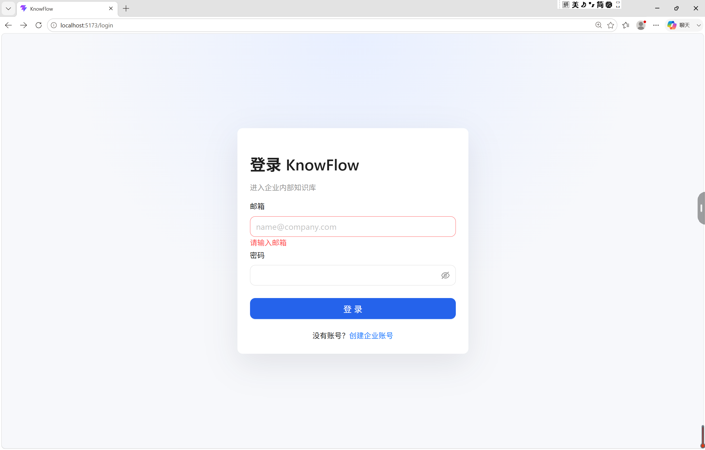
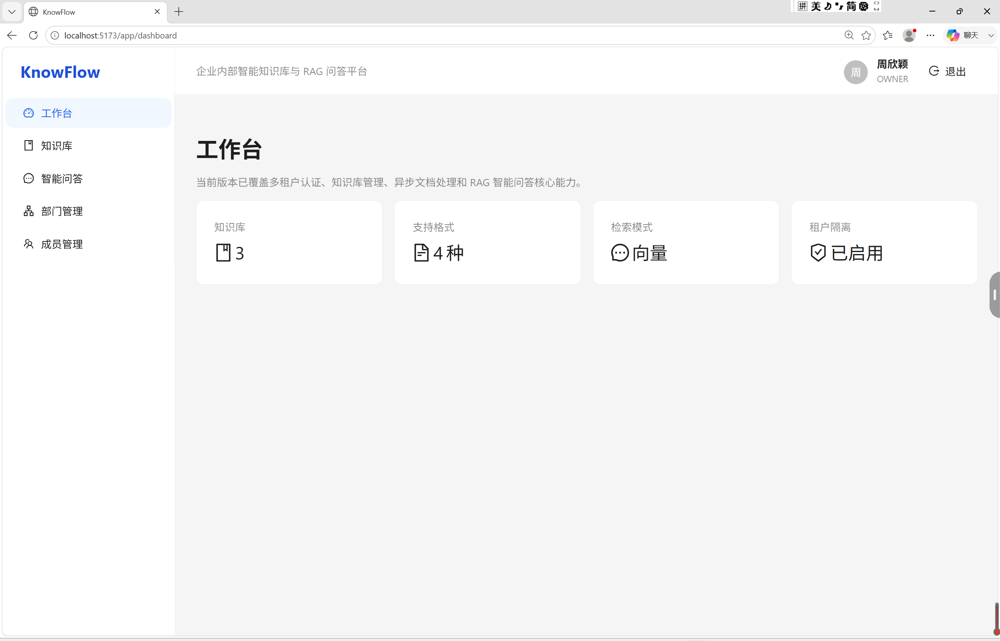
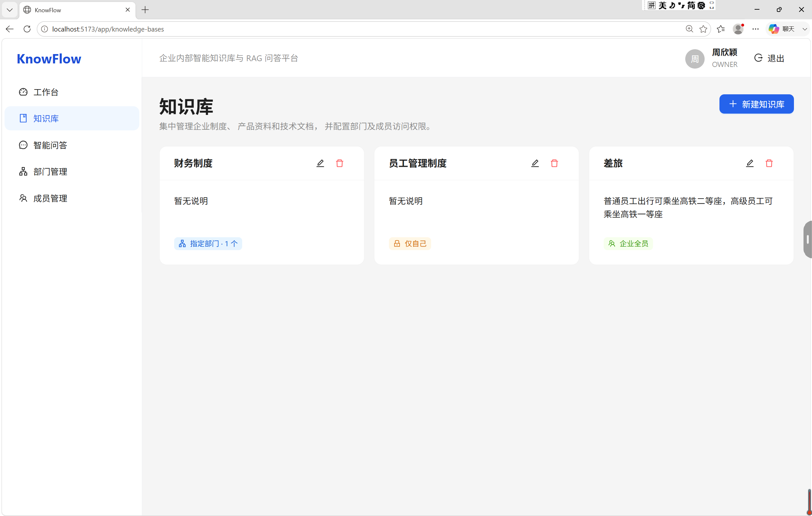
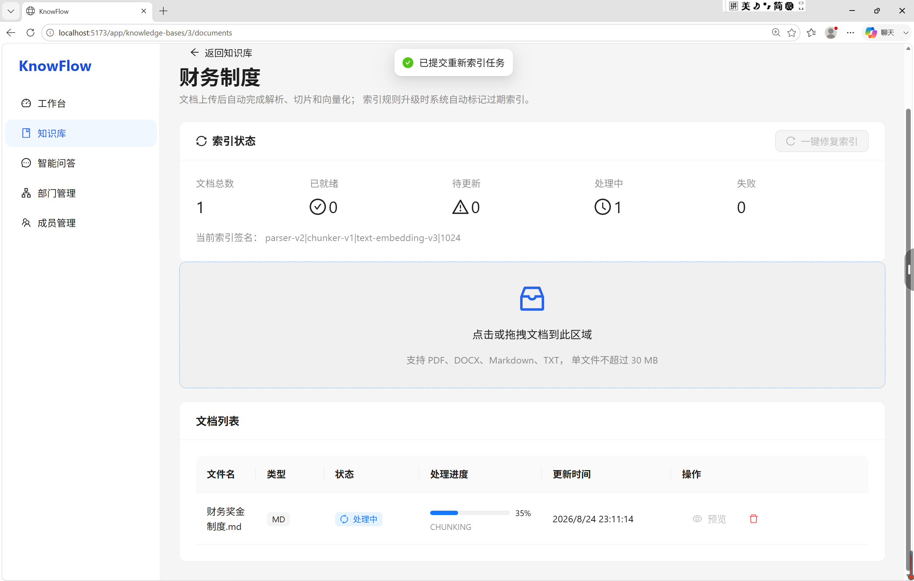
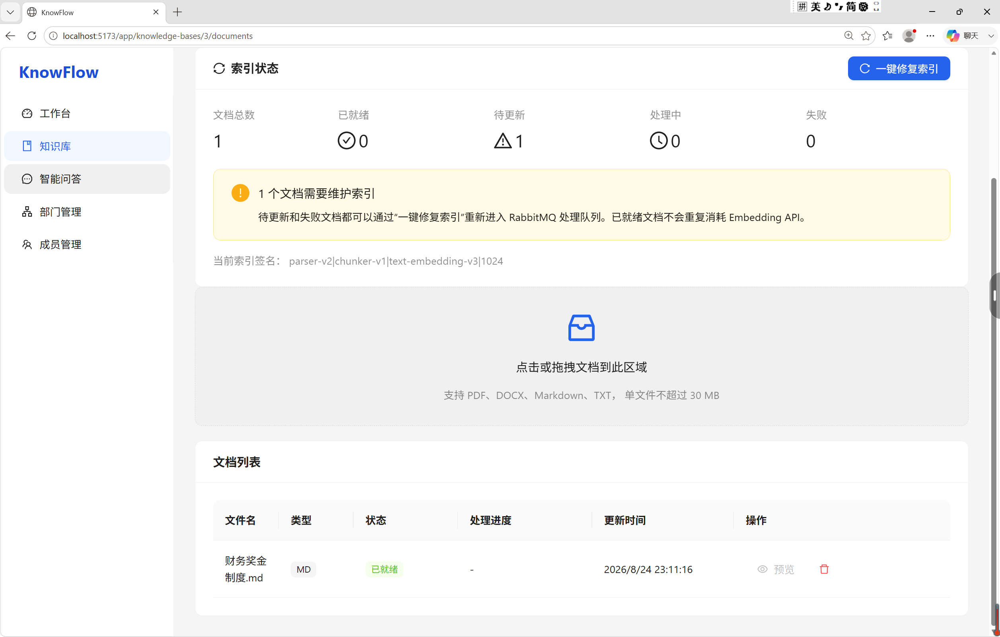
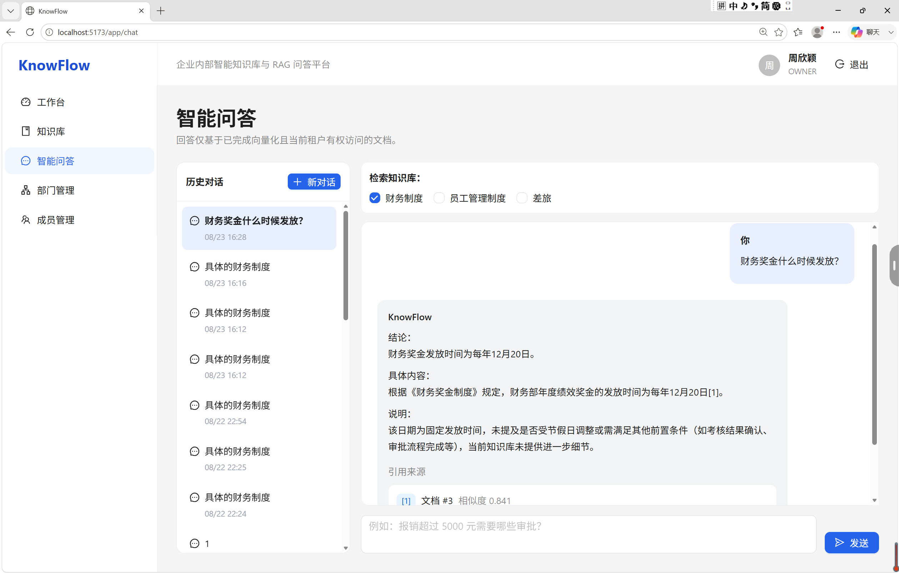
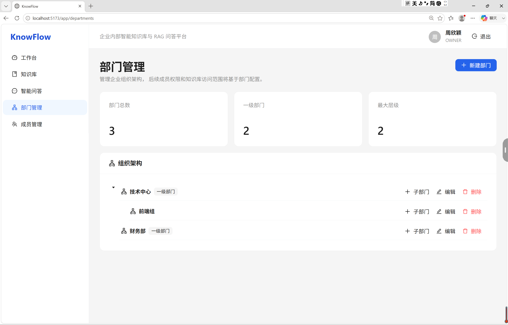
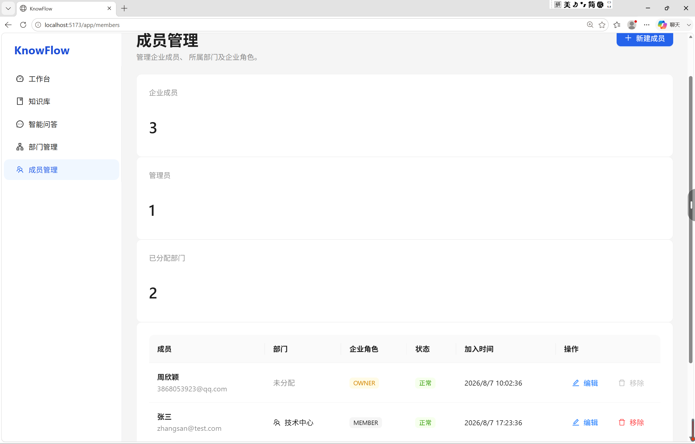

# KnowFlow

<div align="center">

# Enterprise AI Knowledge Assistant Platform

基于 RAG 的企业智能知识库与问答平台

React + Spring Boot + PostgreSQL + pgvector + Qwen

</div>


## 📖 项目介绍

KnowFlow 是一个面向企业内部知识管理场景的智能知识库与问答平台。

系统基于 **Retrieval-Augmented Generation（RAG，检索增强生成）** 技术，将企业内部文档进行解析、切片、向量化存储，并结合大语言模型实现基于企业知识的智能问答。

相比传统关键词搜索，KnowFlow 能够理解用户自然语言问题，通过语义检索找到相关知识片段，并利用大模型生成带有来源依据的回答，降低大模型幻觉问题。

项目主要面向企业内部制度查询、技术文档检索、员工知识助手等应用场景。


---

## ✨ 核心功能


### 1. 企业知识库管理

支持企业内部知识资产统一管理：

- 创建多个知识库
- 上传企业文档
- 文档状态管理
- 知识库权限控制
- 多租户数据隔离


支持文档类型：

- PDF
- DOCX
- Markdown
- TXT


---

### 2. 文档智能处理 Pipeline


完整处理流程：

```
Document Upload

        ↓

Document Parsing

        ↓

Text Chunking

        ↓

Embedding Generation

        ↓

Vector Storage

        ↓

Semantic Retrieval
```


系统通过异步任务处理文档解析和向量化过程，避免大文件处理阻塞主业务。


---

### 3. RAG 智能问答


用户输入问题后：

```
用户问题

   ↓

问题 Embedding

   ↓

pgvector 相似度检索

   ↓

召回相关文档片段

   ↓

构建 RAG Context

   ↓

调用 Qwen 大模型

   ↓

生成回答并展示引用
```


支持：

- 多知识库选择
- 语义搜索
- 文档片段引用
- 相似度展示
- 历史会话管理


示例：

用户：

```
财务奖金什么时候发放？
```


系统：

```
财务奖金发放时间为每年12月20日。

引用来源：

财务奖金制度.md

相似度：0.84
```


---

### 4. 企业权限管理


支持企业组织结构：

```
Tenant

  |

Organization

  |

Department

  |

User
```


实现：

- JWT 用户认证
- 租户隔离
- 用户权限控制
- 知识库 ACL 权限管理


---

# 🏗 系统架构


```
                         User

                          |

                          |

              React + TypeScript

                          |

                          |

                Spring Boot API

                          |

        +-----------------+----------------+

        |                                  |

 Authentication                     Chat Service

        |                                  |

 JWT + ACL                         RAG Pipeline

                                           |

                          +----------------+

                          |

              +-----------+-----------+

              |                       |

        Vector Search              LLM

              |                       |

          pgvector                 Qwen


Document Processing:

Upload

  |

RabbitMQ

  |

Worker

  |

Parser

  |

Chunk

  |

Embedding

  |

Vector Database

```


---

# 🛠 技术栈


## 前端

| 技术 | 说明 |
| --- | --- |
| React | 前端框架 |
| TypeScript | 类型安全 |
| Vite | 构建工具 |
| Ant Design | UI 组件库 |
| Zustand | 状态管理 |
| TanStack Query | 服务端状态管理 |


---

## 后端

| 技术 | 说明 |
| --- | --- |
| Java 21 | 后端开发语言 |
| Spring Boot 3 | 后端框架 |
| Spring Security | 安全认证 |
| JWT | 用户认证 |
| MyBatis-Plus | ORM 框架 |


---

## AI 与检索

| 技术 | 说明 |
| --- | --- |
| Qwen | 大语言模型 |
| Embedding Model | 文本向量化 |
| RAG | 检索增强生成 |
| pgvector | 向量数据库扩展 |


---

## 基础设施

| 技术 | 说明 |
| --- | --- |
| PostgreSQL | 业务数据库 |
| Redis | 缓存 |
| RabbitMQ | 消息队列 |
| MinIO | 对象存储 |
| Docker Compose | 容器编排 |


---

# 📂 项目结构


```
KnowFlow

├── backend
│
│   ├── src/main/java/com/knowflow
│   │
│   ├── auth              # 用户认证
│   ├── chat              # 对话服务
│   ├── document          # 文档处理
│   ├── retrieval         # 向量检索
│   ├── ai                # AI Provider
│   └── security          # 权限控制
│
├── frontend
│
│   ├── src
│   ├── pages
│   └── components
│
├── docker-compose.yml
│
├── README.md

```

## 功能展示

### 1. 用户认证

支持企业用户注册、登录以及基于 JWT 的身份认证。




### 2. 企业工作台

提供企业知识库概览、检索模式、租户隔离状态等核心信息展示。




### 3. 知识库管理

支持创建多个企业知识库，并针对不同知识库配置访问范围。




### 4. 文档解析与向量化

支持 PDF、DOCX、Markdown、TXT 等文档上传。

系统通过异步任务完成：

- 文档解析
- 文本切片
- Embedding 向量化
- 向量索引构建


文档进入处理流程：




完成解析和向量化后：




### 5. RAG 智能问答

基于向量检索召回相关知识片段，并结合大语言模型生成回答。

支持：

- 多知识库选择
- 引用来源展示
- 基于企业文档的精准问答





### 6. 企业组织管理

支持企业部门结构维护，用于后续知识库权限控制。




### 7. 成员权限管理

支持企业成员管理以及角色控制。



---

# 🚀 快速启动


## 环境要求


- Java 21+
- Node.js 20+
- Maven 3.9+
- Docker


---

## 1. 启动基础服务


项目根目录执行：


```bash
docker compose up -d
```


启动：

| 服务 | 端口 |
| --- | --- |
| PostgreSQL | 5432 |
| Redis | 6379 |
| RabbitMQ | 5672 |
| RabbitMQ Management | 15672 |
| MinIO | 9000 |
| Backend | 8080 |
| Frontend | 3000 |


---

## 2. 启动后端


进入 backend：


```bash
cd backend
```


启动：


```bash
mvn spring-boot:run
```


后端地址：

```
http://localhost:8080
```


---

## 3. 启动前端


进入 frontend：


```bash
cd frontend
```


安装依赖：

```bash
npm install
```


启动：

```bash
npm run dev
```


访问：

```
http://localhost:5173
```


---

# 🔥 项目亮点


## 1. 完整 RAG Pipeline


实现企业知识库完整链路：


```
Document

 ↓

Chunk

 ↓

Embedding

 ↓

Vector Search

 ↓

Context Construction

 ↓

LLM Generation

 ↓

Citation
```


---

## 2. 向量数据库设计


使用 PostgreSQL + pgvector 保存文档向量。


优势：

- 与业务数据库统一
- 支持 SQL 查询
- 降低系统复杂度
- 适合企业内部知识场景


---

## 3. 异步文档处理


通过 RabbitMQ 解耦文档处理流程。


```
Upload Service

      |

 RabbitMQ

      |

Document Worker

      |

Embedding Pipeline

```


提高系统稳定性和扩展能力。


---

## 4. AI Provider 抽象设计


通过统一接口封装模型调用：

```
ChatModelProvider

        |

        +---- Mock Provider

        |

        +---- OpenAI Compatible Provider

```


支持后续快速切换不同大模型服务。


---

# 📸 系统截图


## 登录页面


## 工作台


## 知识库管理


## RAG 智能问答


---

# 📌 后续优化方向


- Streaming Token 输出
- Hybrid Search（BM25 + Vector）
- Reranker 重排序模型
- Agent 工作流
- 知识图谱增强
- RAG 自动评测体系


---

# 📄 License


MIT License